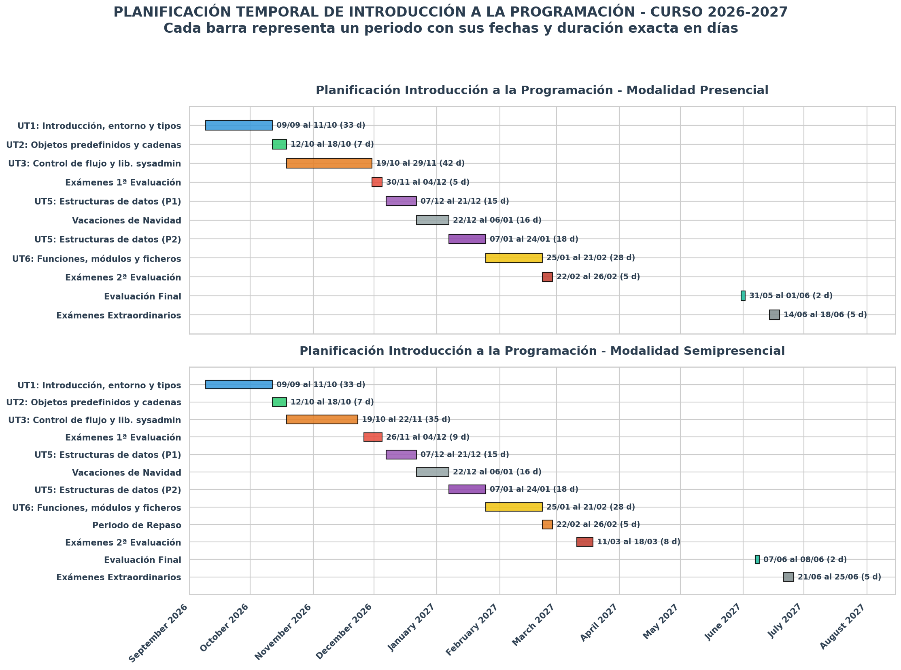

# Planificación del módulo y calendario de trabajo

Este documento resume el ritmo de trabajo del módulo: las unidades, las tutorías colectivas del grupo semipresencial y las entregas que se revisarán cada domingo.

## 1. Vista general del curso

A continuación se muestra una planificación temporal de las Unidades de Trabajo y las evaluaciones a lo largo del curso. Esta planificación queda sujeta a posibles modificaciones.



## 2. Reglas de trabajo durante el curso

- La fecha ordinaria de entrega será el domingo por la noche.
- No habrá entregas entre el 22 de diciembre y el 6 de enero.
- Las entregas se harán en tu repositorio privado del módulo.
- Cada unidad tiene dos bloques: ejercicios de `practicar` y ejercicios de `entregar`.
- Cada bloque se trabaja en su propia rama y con su Pull Request hacia `main` abierta hasta que el profesor indique el cierre.
- Si un bloque ocupa varias semanas, continúa en la misma rama y Pull Request; no abras una rama nueva cada domingo.
- Antes de cerrar una Pull Request, completa el archivo `reflexion.md` de la unidad.

## 3. Cómo entregar cada bloque

### Ejercicios de practicar

Trabaja en:

```text
unidades/uXX-nombre-unidad/ejercicios/practicar/
```

Rama orientativa:

```text
uXX-nombre-unidad-practicar
```

Estos ejercicios sirven para afianzar sintaxis, probar alternativas y localizar errores. Deben contener código ejecutable, commits progresivos y las explicaciones que pida el enunciado.

### Ejercicios de entregar

Trabaja en:

```text
unidades/uXX-nombre-unidad/ejercicios/entregar/
```

Rama orientativa:

```text
uXX-nombre-unidad-entregar
```

En cada entrega debe quedar claro:

- qué ejercicios has completado;
- cómo has comprobado los resultados;
- qué dificultades has tenido y cómo las resolviste;
- qué uso de IA has realizado, si lo hubo;
- una reflexión actualizada en `reflexion.md` al finalizar el bloque.

## 4. Tutorías colectivas del grupo semipresencial

Las tutorías serán normalmente online los lunes por la tarde, en el horario habitual del grupo, aproximadamente cada dos semanas. Se dedicarán a desbloquear conceptos, depurar ejemplos y orientar la entrega más próxima; no serán clases teóricas y no sustituyen el trabajo previo que el alumno debe realizar con los apuntes.

| Fecha | Foco de la sesión | Qué conviene traer preparado |
|---|---|---|
| 14/09 | 1) Arranque, entorno, repositorio, ramas y Pull Requests <br> 2) Inicio UT1 | Guía de entregas leída y cuenta de GitHub creada, si es posible, con el entorno de trabajo y el repositorio de entregas montado. |
| 28/09 | 1) UT1: variables, tipos, entrada/salida y lectura de errores <br> 2) Resolución dudas | Primeros ejercicios de `practicar` intentados. Traer dudas ejercicios concretos. |
| 14/10 | 1) UT2: objetos predefinidos y cadenas. <br> 2) Resolución dudas | Leída la teoría e intentados ejercicios para `practicar`. Traer dudas ejercicios concretos. |
| 26/10 | 1) UT3: condicionales, bucles y trazado manual. <br>  2) Resolución dudas | Ejercicios para `practicar` `if` hechos. Ejercicios para `practicar` de `while` intentados. Traer algún ejercicio con `if` o `while` que haya dado problemas. |
| 09/11 | 1) UT3: funciones de librerías y ejercicio de ejemplo <br>  2) Resolución dudas | Ejercicios para `practicar` terminados.  |
| 16/11 | Cierre de UT3 y dudas antes de la evaluación | Ejercicios para `entregar` casi terminados. Dudas concretas de ejercicios. |
| 09/12 | 1) UT5: listas, mutabilidad, copias y recorrido <br>  2) Resolución dudas | Ejercicios para `practicar` de listas intentados. |
| 11/01 | 1) UT5: diccionarios y elección de estructura  <br>  2) Resolución dudas | Ejercicios para `practicar` de diccionarios intentados. |
| 18/01 | Resolución dudas ejercicios para `entregar` listas y diccionarios | Ejercicios para `entregar` de diccionarios intentados. |
| 01/02 | 1) UT6: ficheros  <br>  2) Resolución dudas sobre funciones y módulos | Primeros ejercicios para `practicar` con rutas o ficheros intentados. |
| 15/02 | 1) Ficheros, `pathlib`, `glob` y tratamiento de errores | Primeros ejercicios para `entregar` intentados |

## 5. Entregas semanales

### UT1 - Introducción, entorno y tipos de datos

| Fecha | Tipo | Rama | Entrega prevista |
|---|---|---|---|
| 20/09 | Seguimiento de practicar | `u01-introduccion-python-practicar` | Entorno preparado, primer programa, ejecuciones desde terminal y ejercicios iniciales sobre variables y tipos. |
| 27/09 | Entrega de practicar | `u01-introduccion-python-practicar` | Ejercicios de entrada/salida, conversiones y operadores resueltos y comprobados. |
| 04/10 | Seguimiento de entregar | `u01-introduccion-python-entregar` | Primeros ejercicios evaluables; deben verse decisiones de tipo, conversiones y pruebas de casos normales y erróneos. |
| 11/10 | Entrega de entregar | `u01-introduccion-python-entregar` | Bloque evaluable completo, `reflexion.md` actualizado y Pull Request lista para revisión. |

### UT2 - Objetos predefinidos y cadenas de texto

| Fecha | Tipo | Rama | Entrega prevista |
|---|---|---|---|
| 18/10 | Entrega de unidad | `u02-objetos-cadenas-practicar` y `u02-objetos-cadenas-entregar` | Ejercicios de métodos, indexación, cortes, formato y validación básica de cadenas. Entrega ambos bloques con su estado real y reflexión de unidad. |

### UT3 - Control de flujo y librerías útiles para sysadmin

| Fecha | Tipo | Rama | Entrega prevista |
|---|---|---|---|
| 25/10 | Seguimiento de practicar | `u03-control-flujo-sysadmin-practicar` | Ejercicios condicionales. |
| 01/11 |  Seguimiento de practicar | `u03-control-flujo-sysadmin-practicar` | Ejercicios bucle while. |
| 08/11 | Entrega de practicar | `u03-control-flujo-sysadmin-practicar` | Ejercicios bucle for. |
| 15/11 | Seguimiento de entregar | `u03-control-flujo-sysadmin-entregar` | Ejercicios condicionales con enfoque sysadmin |
| 22/11 | Entrega de entregar | `u03-control-flujo-sysadmin-entregar` | Ejercicios bucles con enfoque sysadmin.  Documenta lo que quede pendiente. Esta entrega cierra el trabajo ordinario antes de la evaluación.|


### UT5 - Estructuras de datos

| Fecha | Tipo | Rama | Entrega prevista |
|---|---|---|---|
| 13/12 | Seguimiento de practicar | `u05-estructuras-datos-practicar` | Ejercicios de listas para practicar comenzados. |
| 20/12 | Seguimiento de practicar | `u05-estructuras-datos-practicar` | Ejercicios de listas para practicar terminados.| 
| 17/01 | Entrega de practicar  | `u05-estructuras-datos-practicar` | Ejercicios de diccionarios para practicar terminados. |
| 24/01 | Entrega de entregar | `u05-estructuras-datos-entregar` | Ejercicios de listas y diccionarios para entregar. |

### UT6 - Funciones, módulos y ficheros

| Fecha | Tipo | Rama | Entrega prevista |
|---|---|---|---|
| 31/01 | Seguimiento de practicar | `u06-funciones-ficheros-practicar` | Ejercicios de funciones con parámetros, retorno y casos de prueba sencillos. |
| 07/02 | Seguimiento de practicar | `u06-funciones-ficheros-practicar` | Ejercicios de ficheros para practicar. |
| 14/02 | Entrega de practicar | `u06-funciones-ficheros-practicar` | Ejercicios de sysadmin con glob para practicar. |
| 21/02 | Entrega de unidad | `u06-funciones-ficheros-entregar` | Bloque final completo: ejercicios de ficheros para entregar|

## 6. Evaluación y cierre

- La evaluación intermedia se sitúa tras el cierre de UT3; 
- UT4 se desarrolla en la formación en empresa y no genera una entrega semanal en el centro.


## 7. Recomendación final

1. Lee los apuntes antes de empezar cada bloque.
2. Resuelve primero los ejercicios de `practicar` y úsalo para detectar qué necesitas repasar.
3. Haz commits pequeños, con mensajes que expliquen el avance.
4. Actualiza la Pull Request antes de cada domingo de entrega.
5. Llega a la tutoría con código probado y dudas concretas.

El progreso semanal es importante: los ejercicios de entregar deben demostrar comprensión del código, no solo producir una salida correcta.
